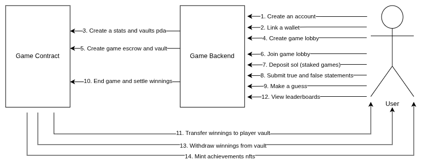

# TruthOrLie  
*A Solana on-chain social game where players compete to know who the best liar is.*

TruthOrLie is a **Proof of Concept** Solana program built with **Anchor**.  
It implements a multiplayer social deception game, achievement tracking, NFT rewards, and fair winner payouts — all enforced with PDAs and on-chain logic.

This POC demonstrates:
- PDA-secured player accounts  
- Game session lifecycle (`create → join → end`)  
- Secure payout distribution  
- Achievement system with an upgrade-authority gate  
- NFT minting for players who unlock certain achievements  

A frontend client is currently in development.

---

## Features

This POC currently includes the following **on-chain instructions**:

### **Player Instructions**
- **`create_player`** – Initialize a new player account (PDA).
- **`update_player`** – Update a player’s stats (internal use).
- **`close_player`** – Close and reclaim rent.

### **Game Session Instructions**
- **`create_session`** – Host initializes a new game session.
- **`join_session`** – Player joins an existing session.
- **`end_session`** – Determines winners, distributes lamports, updates scores.

### **Withdrawals**
- **`withdraw`** – Safely withdraw funds from a player vault.

### **Achievement + NFT System**
- **`whitelist_creators`** – Only approved creators can mint achievement NFTs.
- **`create_collection`** – Creates the NFT collection for achievements.
- **`mint_nft`** – Mint an NFT if the player meets achievement requirements.

---

## Gameplay Flow

1. **Players create an account**  
   Each player initializes their PDA-based player profile.

2. **Host creates a session**  
   A game session PDA is created, including a session vault.

3. **Players join the session**  
   Players lock in and wait for the rounds to be played externally.

4. **Game finishes off-chain**  
   The backend determines:
   - Final scores  
   - Which achievements were unlocked  
   - Who the winners are  

5. **End session**  
   `end_session`:
   - Verifies the session hasn’t ended already  
   - Computes winners  
   - Ensures the number of winner vaults matches  
   - Pays out winnings via PDA authority  
   - Updates player stats  

6. **Players mint achievements (optional)**  
   If a player unlocks an achievement, they can call `mint_nft` to mint it.

---

## Architecture

